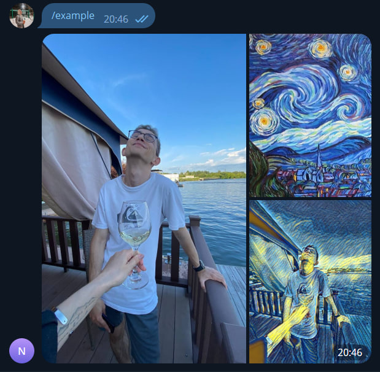
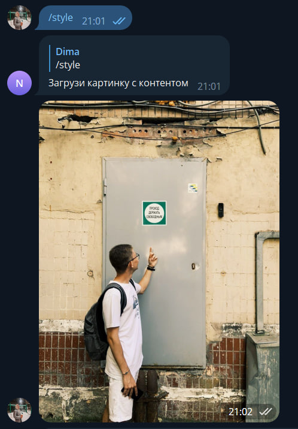
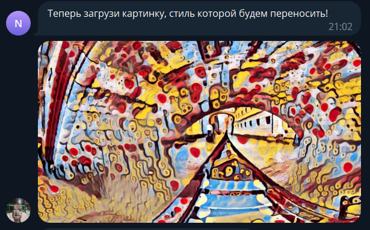
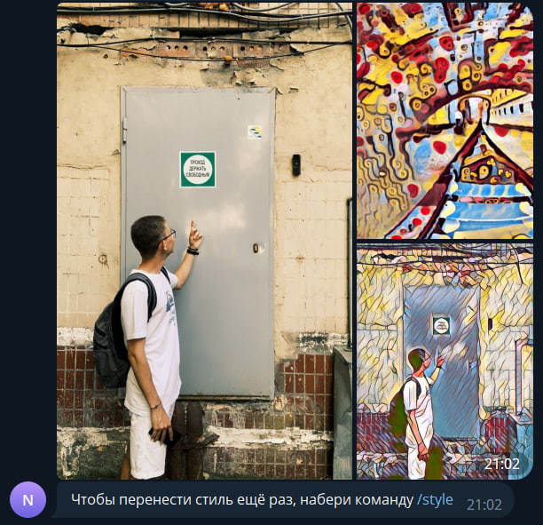

# DLS_bot
Telegram bot: [@DLS_swap_theme_bot][bot]

# Project description
This repository is the final project of the first semester of the course [MIPT School of Deep Learning][DLS].

**Project topic**: implementation of a Telegram bot to transfer your style to your photo.

The project includes:

1. Style Transfer Network
2. Telegram Bot
3. Deploying

# Style Transfer Network
I used [MSG-Net][MSG] made by [Hang Zhang][Zhang] to transfer style from one photo to another. You can learn more about this Net in this [article][article].

# Telegram Bot
Bot was created using [aiogram][aiogram] is modern and fully asynchronous framework for Telegram Bot API written in Python with asyncio and aiohttp.

Don't forget to place your own bot token in config.py!

Bot has three commands:

- /example - to view the example of how MSG-Net works 

- /help - to get some help with bot

- /style - to start neural style transfer process

At first you should download the photo on which you want to transfer style

Then download style image which will be used as style to your content photo

You'll get the result in less than one minute

# Deploying
Telegram bot deployed on VM using VK Cloud. If you want to deploy it yourself you should buy subscription on VK Cloud, create virtual machine and clone this repo into VM's dir.

UPD: Bot doesnt work now. VM on Vk Cloud stopped. 

# Contact
If you have some problems with bot or this repo, contact me!

Telegram: [@Nuoki][telegram_me]

Mail: teslaboysound1111@gmail.com

Vk: [guessitsok][vk_me]

[bot]: https://t.me/DLS_swap_theme_bot
[DLS]: https://dls.samcs.ru/
[Zhang]: https://github.com/zhanghang1989
[MSG]: https://github.com/zhanghang1989/PyTorch-Multi-Style-Transfer#msg-net
[article]: https://arxiv.org/pdf/1703.06953.pdf
[aiogram]: https://aiogram.dev/
[telegram_me]: https://t.me/Nuoki
[vk_me]: https://vk.com/guessitsok
