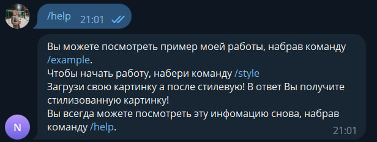

# DLS_bot
Telegram bot: [@DLS_swap_theme_bot][bot]

# Описание проекта
Данный репозиторий представляет собой финальный проект первого семестра курса [Школы Глубокого Обучения МФТИ][DLS].

**Тема проекта**: реализация Telegram бота по Вашего стиля на Вашу фотографию.

Проект включает в себя:

1. Style Transfer Network
2. Telegram Bot
3. Deploying

# Style Transfer Network
I used [MSG-Net][MSG] made by [Hang Zhang][Zhang] to transfer style from one photo to another. You can learn more about this Net in this [article][article].

# Telegram Bot
Bot was created using [aiogram][aiogram] is modern and fully asynchronous framework for Telegram Bot API written in Python with asyncio and aiohttp.

Don't forget to place your own bot token in config.py!

Bot has three commands:

- /example - to view the example of how MSG-Net works 

- /help - to get some help with bot

- /style - to start neural style transfer process

At first you should download the photo on which you want to transfer style

Then download style image which will be used as style to your content photo

# Deploying
Telegram bot deployed on VM using VK Cloud. If you want to deploy it yourself you should buy subscription on VK Cloud, create virtual machine and clone this repo into VM's dir. 

# Contact
If you have some problems with bot or this repo, contact me!

Telegram: [@Nuoki][telegram_me]

Mail: teslaboysound1111@gmail.com

Vk: [guessitsok][vk_me]

[bot]: https://t.me/DLS_swap_theme_bot
[DLS]: https://dls.samcs.ru/
[Zhang]: https://github.com/zhanghang1989
[MSG]: https://github.com/zhanghang1989/PyTorch-Multi-Style-Transfer#msg-net
[article]: https://arxiv.org/pdf/1703.06953.pdf
[aiogram]: https://aiogram.dev/
[telegram_me]: https://t.me/Nuoki
[vk_me]: https://vk.com/guessitsok
